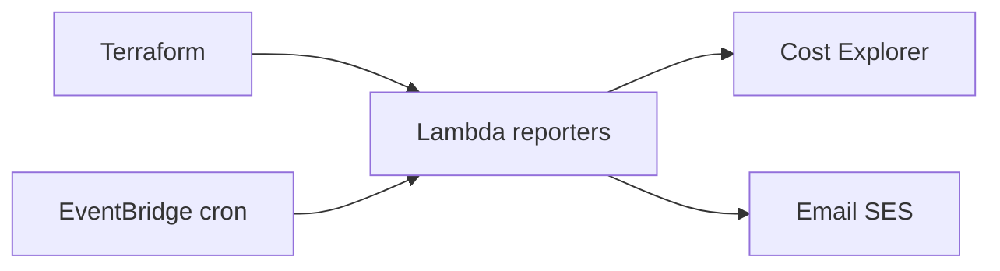

# AWS Budget Report (Lambda + Cost Explorer)

[](LICENSE)
[](https://www.terraform.io/)
[](https://aws.amazon.com/)
[](https://github.com/ghcetraro/terraform_aws_python_budget_report/actions/workflows/ci.yml)

**Reportes automáticos de costos AWS por email — Lambda + Cost Explorer + Terraform**

---

## El problema

Sin visibilidad periódica de costos, los gastos de AWS se descubren tarde. Cost Explorer a mano no escala entre cuentas ni tags.

## La solución

Lambdas programadas que consultan Cost Explorer y envían reportes HTML por correo (diarios/mensuales, multi-cuenta, filtros por tag).



---

## Características

| Área | Detalle |
|------|---------|
| **Lambda Python** | Reporter configurable por mapa `lambda_deploy` |
| **Cost Explorer** | Costos diarios y mensuales por cuenta |
| **Email** | Remitente SES / destinatarios por cuenta |
| **Filtros** | Tags AWS y lookback configurable |
| **IaC** | Todo provisionado con Terraform |

---

## Limitaciones y disclaimer

- Pensado como **punto de partida / referencia**: revisá roles IAM, redes y secretos antes de producción.
- Requiere **credenciales AWS** (recomendado SSO) y, en módulos EKS, acceso al cluster (kubeconfig / exec).
- Completá `locals` y variables según tu cuenta; los ejemplos usan valores ficticios.
- Software open source “as is” — probá primero en un ambiente no productivo.

---

## Stack

Terraform · AWS Lambda · Python · Cost Explorer · SES

---

## Inicio rápido

### Requisitos

- Terraform CLI 1.x
- AWS CLI configurado (`aws sso login` o credenciales)
- Permisos de administración en la cuenta / cluster según el módulo

### Configuración

```bash
# En cada módulo: copiá la plantilla (no commitear terraform.tfvars)
cp terraform.tfvars.example terraform.tfvars
```

Valores de ejemplo: `terraform.tfvars.example`

### Apply

```bash
cp terraform.tfvars.example terraform.tfvars
# Editar valores (cuenta, región, cluster, etc.)

terraform init
terraform plan
terraform apply
```

---

## Documentación

- [Uso y despliegue](docs/uso.md)
- [Presentación / LinkedIn](docs/PRESENTACION.md)
- [Speech para LinkedIn](docs/speech-linkedin.md)
- [Changelog](CHANGELOG.md)
- [Contribuir](CONTRIBUTING.md)
- [Seguridad](SECURITY.md)

---

## Seguridad

**No commitees** `terraform.tfvars`, state, claves ni tokens. Usá `*.tfvars.example` como plantilla.

Ver [SECURITY.md](SECURITY.md).

---

## Licencia

[MIT](LICENSE) — Copyright (c) Gabriel Cetraro

---

## Autor

Proyecto open source de **Gabriel Cetraro** — automatización de infraestructura, AWS, Kubernetes y observabilidad.

Si te resulta útil, ⭐ en GitHub ayuda a darle visibilidad.
