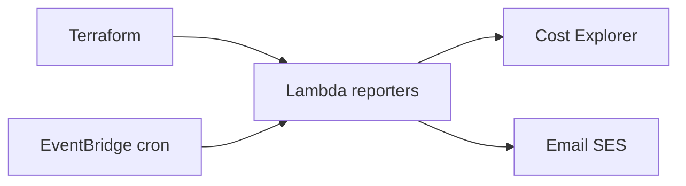

# Presentación — AWS Budget Report (Lambda + Cost Explorer)

Material listo para publicar en **LinkedIn** (post + carrusel). Copiá cada sección como una diapositiva o bloque del post.

**Speech listo para copiar/pegar:** [speech-linkedin.md](speech-linkedin.md)

---

## Slide 1 — Hook

### ¿Cuánto gastaste en AWS esta semana… sin abrir la consola?

Presento **AWS Budget Report (Lambda + Cost Explorer)**: Reportes automáticos de costos AWS por email — Lambda + Cost Explorer + Terraform

Terraform · AWS Lambda · Python · Cost Explorer · SES

---

## Slide 2 — El dolor

- Varias cuentas sin un reporte unificado
- Tags y filtros hechos a mano
- Nadie mira Cost Explorer todos los días

**Automatizar esto no es lujo — es repetibilidad.**

---

## Slide 3 — Qué hace

---

## Slide 4 — Características

- **Lambda Python**: Reporter configurable por mapa `lambda_deploy`
- **Cost Explorer**: Costos diarios y mensuales por cuenta
- **Email**: Remitente SES / destinatarios por cuenta
- **Filtros**: Tags AWS y lookback configurable
- **IaC**: Todo provisionado con Terraform

---

## Slide 5 — Cómo probarlo

1. Cloná el repo
2. Copiá `terraform.tfvars.example` → `terraform.tfvars`
3. `terraform init && plan && apply`
4. Revisá outputs / recursos en la consola AWS

Repo: `https://github.com/ghcetraro/terraform_aws_python_budget_report`

---

## Slide 6 — CTA

Open source · MIT · listo para adaptar a tu cuenta.

⭐ Si te sirve, estrella en GitHub y compartí feedback.

`https://github.com/ghcetraro/terraform_aws_python_budget_report`
